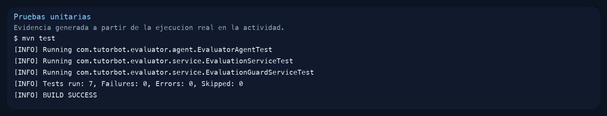
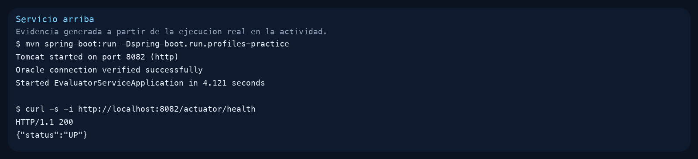
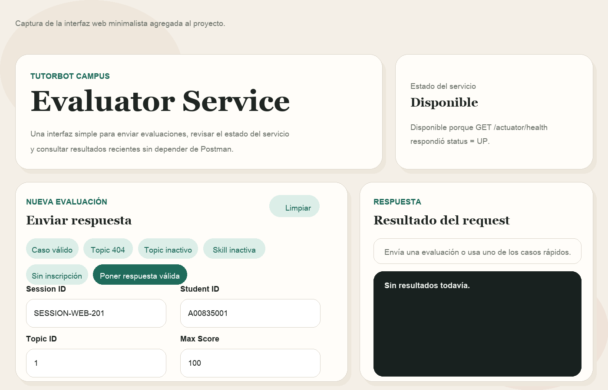
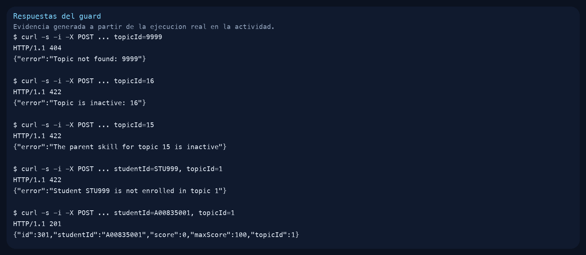

# EvaluationGuard Assignment #3

## Work Completed
This activity was developed on top of the base project located at `TutorBot/tutorbot-campus/backend/evaluator-service` to execute the `EvaluationGuardService` assignment described in the document. During validation, the flow before the Ollama call was confirmed with:

- entities `Skill`, `Topic`, and `LearningPathEntity`
- domain exceptions for `TopicNotFound`, `TopicInactive`, `SkillInactive`, and `StudentNotEnrolled`
- repositories `TopicRepository` and `LearningPathRepository`
- `EvaluationGuardService` injected as the first line inside `EvaluationService`
- `GlobalExceptionHandler` returning `404` and `422`
- unit tests passing successfully

Verified scenarios during execution:

- `topicId=9999` returns `404 Not Found`
- `topicId=16` returns `422 Unprocessable Entity`
- `topicId=15` returns `422 Unprocessable Entity`
- `studentId=STU999, topicId=1` returns `422 Unprocessable Entity`
- `studentId=A00835001, topicId=1` returns `201 Created`

## Commands Required to Run the Project

Run the following commands starting from the `Sprint_2_Web` folder.

### 1. Start Oracle
```bash
cd TutorBot/tutorbot-campus/infrastructure
docker compose -f docker-compose-practice.yml up -d oracle-db
```

### 2. Load the Base Scripts
```bash
docker cp TutorBot/tutorbot-campus/infrastructure/oracle/V1__init_schema.sql oracledb:/tmp/V1__init_schema.sql
docker cp TutorBot/tutorbot-campus/infrastructure/oracle/V2__seed_data.sql oracledb:/tmp/V2__seed_data.sql
docker exec oracledb bash -lc "printf '@/tmp/V1__init_schema.sql\nEXIT;\n' | /opt/oracle/product/21c/dbhomeXE/bin/sqlplus -s Adolfo/password@//localhost:1521/XEPDB1"
docker exec oracledb bash -lc "printf '@/tmp/V2__seed_data.sql\nEXIT;\n' | /opt/oracle/product/21c/dbhomeXE/bin/sqlplus -s Adolfo/password@//localhost:1521/XEPDB1"
```

### 3. Run the Tests
```bash
cd TutorBot/tutorbot-campus/backend/evaluator-service
mvn test
```

### 4. Start the Service
```bash
cd TutorBot/tutorbot-campus/backend/evaluator-service
mvn spring-boot:run -Dspring-boot.run.profiles=practice
```

### 4.1 Open the Web Interface
With the service running, open:

```text
http://localhost:8082/
```

### 4.2 Check Service Health
The interface calls `GET /actuator/health` to verify whether the backend is available.

```bash
curl -s http://localhost:8082/actuator/health
```

Expected response:

```json
{"status":"UP"}
```

When that endpoint responds with `UP`, the interface shows `Available`. If it does not respond or returns another status, the interface reflects that state.

### 5. Test the Main Endpoint
```bash
curl -s -i -X POST http://localhost:8082/api/v1/evaluations \
  -H 'Content-Type: application/json' \
  -d '{"sessionId":"SESSION-ASSIGNMENT-201","studentId":"A00835001","questionText":"¿Qué es HTML?","studentAnswer":"Es un lenguaje de marcado.","correctAnswer":"HTML es un lenguaje de marcado.","maxScore":100,"topicId":1}'
```

## Execution Note
To run the practice with this local copy of the repository, the runtime database had to be temporarily aligned because the `V1__init_schema.sql` and `V2__seed_data.sql` scripts in this folder do not include `SKILLS`, `LEARNING_PATHS`, or the `ACTIVE` and `SKILL_ID` columns in `TOPICS`, even though the assignment document assumes they already exist. Those repository scripts were not modified.

## Evidence

### Unit Tests


### Service Running


### Web Interface


### Guard Responses


## Authors
José Emilio Inzunza García | A01644973

Yael García Morelos | A01352461

Patricio Blanco Rafols | A01642057

Arturo Gómez Gómez | A07106692

Andrés Gallego López | A01645740
